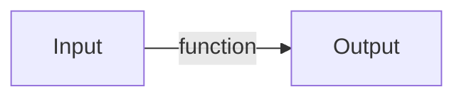

# Javascript

* Also called ECMAScript
* High level language that is used to provide logic for web applications

* Used on servers and browsers
* Very speed 🚄

---

# Functions

* Blocks of code that does something
* Like mathematical functions, it has
  * **Input** (parameters/arguments)
  * **Output** (return value)



```javascript
function <name>(<arguments>) {
  return <return value>
}
```

---

# Functions

<Runner code="console.log(3)">

```javascript
function add(x, y) {
    return x + y
}

add(1, 2)
```

</Runner>

<br/>

<Runner code="console.log(1)">

```javascript
function minus(x, y) {
    return x - y
}

minus(5, 4)
```

</Runner>

---

# Showing output

* Show output/print using `console`
* Multiple logging levels
  * `log`
  * `warn`
  * `error`

<Runner code="console.log('This will show in the console!'); console.warn('I like orange'); console.error('This will be red')">

```javascript
console.log('This will show in the console!')
console.warn('I like orange')
console.error('This will be red')
```

</Runner>

---

# Comments

* Comments are pieces of code that isn't ran
* You are recommended to add comments to provide helpful information to other people editing the code

Single line comment

<Runner code="console.log('This will show in the console!')">

```javascript
console.log('This will show in the console!'); // This is a comment
```

</Runner>

Multi-line comment (start with `/*` and end with `*/`. You can also add extra `*`s to make it look nice)

<Runner code="console.log('This will show in the console!')">

```javascript
/**
 * The asterisk on this line is just to make it look nice
 You could remove it if you want, but now it looks less nice :<
 */
console.log('This will show in the console!'); 
```

</Runner>

---

# Variables

* Data is stored in variables, the creation of a variable is called a declaration
  * Different declarations have different accessibility
* There are three ways to declare variables [^1]

`(var|let|const) <name of variable> = <value>`

| Keyword | Accessibility                                   | Should I use this?     |
|---------|-------------------------------------------------|------------------------|
| `var`   | Within the function it's declared in            | Avoid unless necessary |
| `let`   | Within the closest curly braces --- `{` and `}` | ✅                      |
| `const` | Creates a constant variable                     | ✅                      |

[^1]: [Variable declarations](https://developer.mozilla.org/en-US/docs/Learn/JavaScript/First_steps/Variables#a_note_about_var)

<!-- There are key differences between `var` and `const`, but we will not go through them all today. Let's just go through the key differences -->

---

# Variables

##### `var`

Available before declaration as `undefined`

<Runner code="console.log(undefined); console.log('I am everywhere!')">

```javascript
console.log(everywhere)
var everywhere = 'I am everywhere!'
console.log(everywhere)
```

</Runner>

---

# Variables

##### `let`

Not available before declaration

<Runner code="console.error(`Uncaught ReferenceError: Cannot access 'everywhere' before initialization`)">

```javascript
console.log(everywhere)
let everywhere = 'I am everywhere!'
console.log(everywhere)
```

</Runner>

But this works!

<Runner code="console.log(`I am everywhere!`)">

```javascript
let everywhere = 'I am everywhere!'
console.log(everywhere)
```

</Runner>


---

# Variables

##### `const`

Used for variables that **shouldn't be updated**

<Runner code="console.log('T0411111B')">

```javascript
const MY_NRIC = 'T0411111B'
console.log(everywhere)
```

</Runner>

---

# Types of variables

We used one type of variable just now, a `String`. but there are others!

* Different types can store different variations of data, to make your life easier

| Type      | Usage               |
|-----------|---------------------|
| `String`  | Used for text       |
| `Number`  | Used for numbers    |
| `Boolean` | Used for true/false |
| `Object`  | Used for objects    |
| `Array`   | Used for arrays     |

---

# Objects

* A key-value pair
* Declare using curly braces
  * `{` and `}`

```javascript
const jimmy = {
    name: 'Jimmy',
    age: 21,
    isCool: true,
    friends: ['John', 'Jane', 'Jim'],
}

```

To access the values in the object use the dot notation, or the bracket notation

<Runner code="console.log('Jimmy'); console.log(21);">

```javascript
console.log(jimmy.name) // Dot notation
console.log(jimmy['age']) // Bracket notation
```

</Runner>

---

# Array

* A list of values
* Declare using square brackets
  * `[` and `]`

Jimmy has many friends, we want to store the names of his friends, so we use an `Array`

```javascript
const friends = ['John', 'Jane', 'Jim']
```

<v-click>

To access the values in the array, we have to get the *index* of the item

An *index* refers to the position of the item in the array.

Indexes start from 0.

<Runner code="console.log('Jane')">

```javascript
console.log(friends[1])
```

</Runner>
</v-click>

---
layout: center
---

# 5 minutes break

---

# Destructuring

* Destructuring is another way to extract values from objects and arrays

This is array destructuring

<Runner code="console.log('John')">

```javascript {all|2}
const friends = ['John', 'Jane', 'Jim']
const [firstFriend, secondFriend, thirdFriend] = friends
console.log(firstFriend)
```

</Runner>

This is object destructuring

<Runner code="console.log(21)">

```javascript {all|2}
const jimmy = { name: 'Jimmy', age: 21, isCool: true, friends: ['John', 'Jane', 'Jim'] }
const { age } = jimmy
```

</Runner>

---

# Control flow

* Customize the behavior of your program based on a condition
* There are three keywords to do this
  * `if`
    * If condition is true, run block. Else, move down
  * `else if`
    * If condition above is false and
    * If condition is true, run block. Else, move down
  * `else`
    * Run block

```javascript
if (<condition 1>) {
  // Code to execute if condition 1 is true
} 
else if (<condition 2>) { 
  // Code to execute if condition 1 is false and condition 2 is true
}
else {
  // Code to execute if condition 1 and condition 2 are both false
}
```

---

# Comparators

* Sometimes we want to compare different values
  * For example, if variable `x` is greater than `y`

| Comparator | Explanation              | Usage    |
|------------|--------------------------|----------|
| `>`        | Greater than             | `x > y`  |
| `<`        | Less than                | `x < y`  |
| `>=`       | Greater than or equal to | `x >= y` |
| `<=`       | Less than or equal to    | `x <= y` |
| `==`       | Equal to                 | `x == y` |
| `!=`       | Not equal to             | `x != y` |

<style>
  code {
    font-family: monospace !important;
  }
</style>

---

# Advanced comparators

* Javascript is weird sometimes, so we have to use a little bit of extra code to make some stuff work

For example

<Runner code="console.log(2 == '2')">

```javascript
console.log(2 == "2")
```

</Runner>

But `2` is not equals to `"2"`! One is a `Number` and the other is a `String`

To enforce checking of types, we add one more `=`, like so: `===` and `!==`

<Runner code="console.log(2 === '2')">

```javascript
console.log(2 === "2")
```

</Runner>

<style>
  code {
    font-family: monospace !important;
  }
</style>

