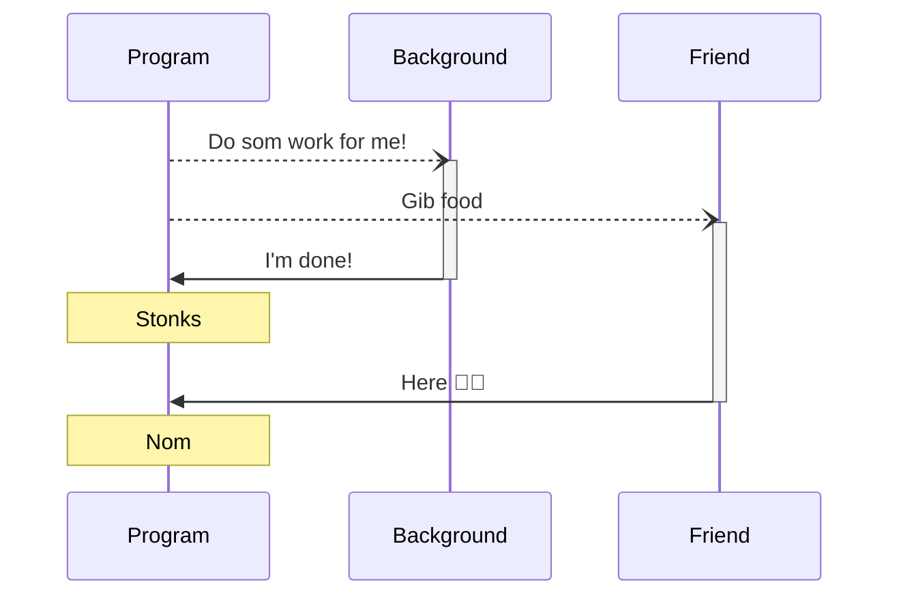

# Loops

Loops are used to do things that are repetitive, like printing out something `10` times

There are two ways:
* A `for` loop
* A `while` loop

`for (<initialization>; <condition>; <final expression>) {}`

<Runner code="for (let idx = 0; idx < 10; idx++) { console.log(idx) }">

```javascript
for (let idx = 0; idx < 10; idx++) {
  console.log(idx)
}
```

</Runner>

---

# Loops

##### `while`

This is the same code as a while loop

`while (<condition>) {}`

<Runner code="let idx = 0; while (idx < 10) { console.log(idx); idx++ }">

```javascript
let idx = 0
while (idx < 10) {
  console.log(idx)
  idx++
}
```

</Runner>

---

# Error handling

* Sometimes code gives us errors, and we need to handle them
  * For example, if we try to access a variable that doesn't exist

* To handle errors, we use a `try` block and a `catch` block
  * `try` is used to try something
  * `catch` is used to handle the error

---

# Error handling

Let's take the example from just now

<Runner code="console.error(`Uncaught ReferenceError: Cannot access 'everywhere' before initialization`)">

```javascript
console.log(everywhere)
let everywhere = 'I am everywhere!'
console.log(everywhere)
```

</Runner>

Catching the error:

<Runner code="console.error('There was an error, but I caught it!')">

```javascript
try {
  console.log(everywhere)
  let everywhere = 'I am everywhere!'
  console.log(everywhere)
} 
catch (error) {
  console.error('There was an error, but I caught it!')
}
```

</Runner>

---
layout: two-cols
---

# Concurrency

* Some code we write takes a long time to run
  * For example, reading a large file, or doing some big calculations
* We want to *run* that code in the **background**, so we can keep our browser responsive
  * In the meantime, the program can also do other stuff 🍉🍇

***

* Concurrent code is also known as **<u>asynchronous</u>** code
* Inversely, non-concurrent code is known as <u>synchronous</u> code

::right::



---

# Concurrency

* Concurrent code is usually ran in a function [^1]
* To make a function concurrent, we add the `async` keyword
* We use the `await` keyword to wait for a task to finish

<Runner code="sleep(10000); console.log('Done with assignment!')">

```javascript
async function startAssignment() {  
  sleep('10 seconds') // Simulate falling asleep
  console.log('Done with assignment!')
}
startAssignment()
```

</Runner>

Wait, our assignment finished instantly!? That's because we didn't use `await`

Our task runs in the background, and the code continues to run without **awaiting** for it

[^1]: [In depth `async`](https://developer.mozilla.org/en-US/docs/Web/JavaScript/Reference/Global_Objects/Promise)

---

# Concurrency

Let's `await` our code and make the duration shorter

<Runner code="await sleep(5000); console.log('Done with assignment!')">

```javascript
async function startAssignment() {  
  await sleep('5 seconds') // Simulate falling asleep
  console.log('Done with assignment!')
}
startAssignment()
```

</Runner>

Now we actually take time to do the assignment!

---

# Code splitting

* Sometimes files get large, so we want to break it down into more manageable bits
  * For example, separating our functions into different files
* This means we have to **import** and **export** our functions to use them

***

For example:

`students.js` **exports** a function --- `getStudents()`

`school.js` **imports** the `getStudents()` function

---

# Code splitting

* Modern way to do imports and exports is to use the `import` and `export` keywords
  * This is also called ESM imports (**E**cma**S**cript **M**odule imports)
* A file can have multiple imports and exports
* Imports rely on object destructuring, which we covered earlier

<div class="grid gap-3 grid-cols-2">
<div>

`students.js`
```javascript
export function getStudents() {}
export function getTeachers() {}
```

</div>
<div>

`school.js`
```javascript
// Destructure and get the individual functions!
import { getStudents, getTeachers } from './students.js'

// OR

const { getStudents, getTeachers } = import('./students.js')
```

</div>
</div>

---

# Extra content

For y'all speedsters

[Document Object Model](https://developer.mozilla.org/en-US/docs/Web/API/Document_Object_Model/Introduction)

[Fetch API](https://developer.mozilla.org/en-US/docs/Web/API/Fetch_API/Using_Fetch)
