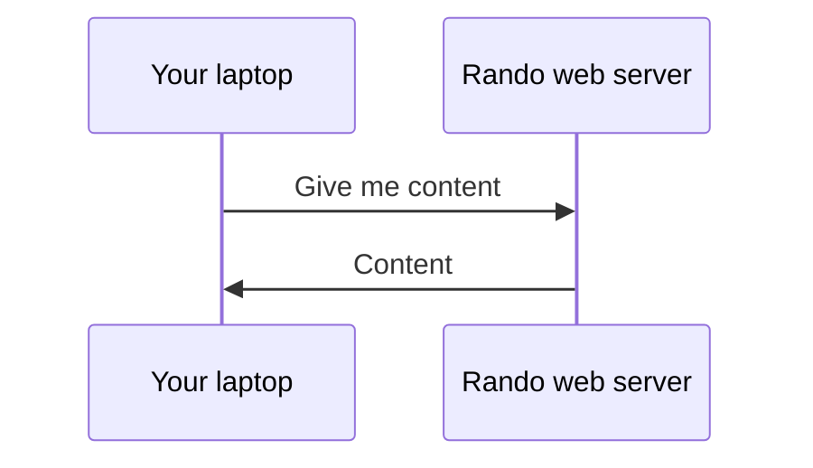

---
layout: cover
---

# Web Fundamentals

6.35pm - 7.20pm

---
layout: two-cols
---

# How does the web work?

HTTP: Hypertext Transfer Protocol [^1]

<v-click>

Sending data (files) over the internet

* The foundation of any data exchange on the Web

</v-click>

<v-click>

Request --> Response

* A client-server protocol; requests are initiated by the recipient, usually the Web browser

</v-click>

::right::

[^1]: [Learn more](https://developer.mozilla.org/en-US/docs/Web/HTTP/Overview)

---

# HTTP status codes

<v-clicks>

* Indicates the type of response; each range represents a different kind
* Number ranging from `100` - `599`

</v-clicks>

<v-click>

| Range         | Type                  | Common examples             |
| ------------- | --------------------- | --------------------------- |
| `100` - `199` | Information responses | `101` Switching Protocol    |
| `200` - `299` | Successful responses  | `200` OK                    |
| `300` - `399` | Redirection messages  | `301` Moved Permanently     |
| `400` - `499` | Client errors         | `404` Not Found             |
| `500` - `599` | Server errors         | `503` Service Unavailable   |

</v-click>

---
layout: center
---

# HTML, CSS, JS

---
layout: two-cols
---

# HTML, CSS, JS

* HTML: Hypertext Markup Language
  * Provides the content of your webpage

* CSS: Cascading Style Sheets
  * Provides styling of your webpage

* JS: JavaScript
  * Provides the functionality of your webpage

::right::

  

    
    
  

  

---
src: ./html.md
---

---
layout: cover
---

# Break

7.35pm - 7.45pm

---
src: ./js-part-1.md
---

---
src: ./js-part-2.md
---

---
layout: center
---

# A HTML file

---
src: ./html-file-structure.md
---
---
layout: center
---

# Vue

---
src: ./vue.md
---

---

# Practical time

* Build a to do list
* **Bonus 🏆**: Add funny styles
* **Bonus 🏆**: Add grouping for your to do items

---
layout: cover
---

# Thank you for comming !

(☞ﾟヮﾟ)☞ ☜(ﾟヮﾟ☜)

  

