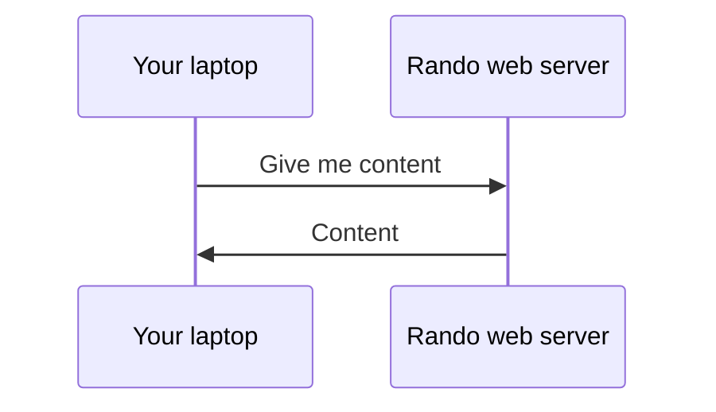

---
layout: cover
---

# Web fundamentals

10.15am - 11.30pm

---
layout: two-cols
---

# How does the web work?

HTTP: HyperText Transfer Protocol [^1]

<v-click>

Sending data (files) over the internet

</v-click>

<v-click>

Request --> Response

</v-click>

::right::

[^1]: [Learn more](https://developer.mozilla.org/en-US/docs/Web/HTTP/Overview)

---

# HTTP status codes

<v-clicks>

* Indicates type of response
* Number ranging from 100 - 599
* Each range represents a different type of response!

</v-clicks>

<v-click>

| Range     | Type                  | Common examples           |
| --------- | --------------------- | ------------------------- |
| 100 - 199 | Information responses | 101 Switching Protocol    |
| 200 - 299 | Successful responses  | 200 OK                    |
| 300 - 399 | Redirection messages  | 302 Moved Permanently     |
| 400 - 499 | Client errors         | 400 Bad Request           |
| 500 - 599 | Server errors         | 503 Internal Server Error |

</v-click>

---
layout: center
---

# HTML, CSS, JS

---
layout: two-cols
---

# HTML, CSS, JS

* HTML: Hypertext Markup Language
  * Provides the content of your webpage
  * Written in XML (Extensible Markup Language)
  
* CSS: Cascading Style Sheets
  * Provides styling of your webpage

* JS: Javascript
  * Provides the functionality of your webpage

::right::

  

    
    
  

  

---
src: ./html.md
---

---
src: ./js-part-1.md
---

---
layout: cover
---

# Games

11.30am - 12.15pm

---
layout: cover
---

# LONCH 🐔

12.15pm - 1.15pm

---
layout: cover
---

# Web fundamentals + Vue

1.15pm - 4.30pm

---
src: ./js-part-2.md
---

---
layout: center
---

# An HTML file

---
src: ./html-file-structure.md
---

---
layout: center
---

# 5 minutes break

---
layout: center
---

# Vue

---
src: ./vue.md
---

---
layout: center
---

# 10 minutes break

---
layout: center
---

# CSS

---
src: ./css.md
---

---
layout: cover
---

# Practical time

4.30pm - 5.30pm

---

# Practical time

4.30pm - 5.15pm

* Build a to do list
* **Bonus 🏆**: Add funny styles
* **Bonus 🏆**: Add grouping for your to do items

