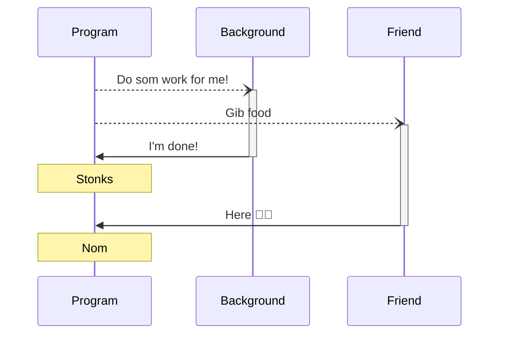

# HTML

* Structure of our webpage
* Consists of **HTML tags**
* **HTML tags** can have attributes

```html {all|1-3|3|all}
<div>
    <h1>I am an element</h1>
    <h1 id="some-id" style="color: red;">
      I am an element with many attributes
    </h1>
</div>
```

---
layout: center
---

# Javascript

---

# Functions

Functions have an **input** (parameters/arguments) and an **output** (return value)

```javascript
function say(message) {
    console.log(message)
}

function add(a, b) {
    return a + b
}
```

"Run" or "call" a function:

```javascript
say("Hello there!") // Output: Hello there!
say(add(1, 3)) // Output: ??
```

---

# Variables

| Keyword | Accessibility                                   | Should I use this?     |
|---------|-------------------------------------------------|------------------------|
| `var`   | Within the function it's declared in            | Avoid unless necessary |
| `let`   | Within the closest curly braces --- `{` and `}` | ✅                      |
| `const` | Creates a constant variable                     | ✅                      |

---

# Variables

`const`

```javascript
console.log(name) // Error: Usage before declaration
const name = "Qin Guan"
name = "Something else" // Error: Assignment to constant variable
```

`let`

```javascript
console.log(name) // Error: Usage before declaration
let name = "Qin Guan"
name = "Something else" // No error!
```

`var`

```javascript
console.log(name) // No error! But will show `undefined`
var name = "Qin Guan"
name = "Something else" // No error!
```

---

# Variables

| Type      | Usage               | Is a primitive type  |
|-----------|---------------------|----------------------|
| `String`  | Used for text       | ✅                    |
| `Number`  | Used for numbers    | ✅                    | 
| `Boolean` | Used for true/false | ✅                    |
| `Object`  | Used for objects    | ❌                    |
| `Array`   | Used for arrays     | ❌                    |

---

# Objects and arrays

Remember to use **commas** to separate values

```javascript
const jimmy = { // Curly brackets
    name: 'Jimmy', // <- Note: there is a comma here
    age: 21 // age is the object key, and 21 is the corresponding value
}

console.log(jimmy.name, jimmy['age']) // Output: Jimmy, 21
```

```javascript
const jimmyFriends = [ // Square brackets
    'Qin Guan', // <- Note: again, there is a comma here
    'Wai Hang',
    'Jimmy'
]

// Arrays start from position 0
console.log(jimmyFriends[1], jimmyFriends[2]) // Output: Wai Hang, Jimmy
```

---

# Destructuring

```javascript
const jimmy = { // Curly brackets
    name: 'Jimmy', // <- Note: there is a comma here
    age: 21 // age is the object key, and 21 is the corresponding value
}

const {name, age} = jimmy
console.log(name, age) // Output: Jimmy, 21
```

```javascript
const jimmyFriends = [ // Square brackets
    'Qin Guan', // <- Note: again, there is a comma here
    'Wai Hang',
    'Jimmy'
]

const [firstFriend, secondFriend, thirdFriend] = jimmyFriends
console.log(firstFriend, secondFriend) // Output: Qin Guan, Wai Hang
```

---
layout: two-cols
---

# Control flow

* There are three keywords to do this
  * `if`
    * If condition is true, run block. Else, move down
  * `else if`
    * If condition above is false and
    * If condition is true, run block. Else, move down
  * `else`
    * Run block

::right::

```javascript
if (<condition 1>) {
    // Code to execute if condition 1 is true
}
else if (<condition 2>) {
    // Code to execute if condition 1 is false and condition 2 is true
}
else {
    // Code to execute if condition 1 and condition 2 are both false
}
```

---

# Comparators

* The conditions we used are built using comparators

| Comparator | Explanation              | Usage    |
|------------|--------------------------|----------|
| `>`        | Greater than             | `x > y`  |
| `<`        | Less than                | `x < y`  |
| `>=`       | Greater than or equal to | `x >= y` |
| `<=`       | Less than or equal to    | `x <= y` |
| `==`       | Equal to                 | `x == y` |
| `!=`       | Not equal to             | `x != y` |

---

# Advanced comparators

```javascript
console.log(2 == "2") // Output: true
```

But `2` is not equals to `"2"`! One is a `Number` and the other is a `String`

To enforce checking of types, we add one more `=`, like so: `===` and `!==`

```javascript
console.log(2 === "2") // Output: false
```

---

# Loops

<v-clicks>

* There are two types of loops --- `for` and `while`
* `for` can be used to iterate over arrays and objects, unlike `while`

```javascript
for (let idx = 0; idx < 10; idx++) {
    console.log(idx) // output: 0 1 2 3 4 5 6 7 8 9
}

const friends = ['Qin Guan', 'Jimmy', 'Wai Hang']
for (const idx in friends) {
    console.log(friends[idx]) // output: Qin Guan Jimmy Wai Hang
}

for (const friend of friends) {
    console.log(friend) // output: same as above
}
```

</v-clicks>

---

# Loops

* `while` loops allow you to loop infinitely

```javascript
let idx = 0
while (idx < 10) {
    console.log(idx) // output: 0 1 2 3 4 5 6 7 8 9
    idx++
}

const friends = ['Qin Guan', 'Jimmy', 'Wai Hang']
let idx = 0
while (idx < friends.length) {
    console.log(friends[idx] // output: Qin Guan Jimmy Wai Hang)
    idx++
}
```

---

# Error handing

* We can handle unexpected errors in our code by wrapping it in `try` and `catch`

```javascript
try {
    console.log(everywhere) // 1. This will throw a ReferenceError
    let everywhere = 'I am everywhere!'
    console.log(everywhere)
} catch (error) { // 2. It will be caught and assigned to the error variable
    console.error('There was an error, but I caught it!') // 3. This will run
}
```

---
layout: center
---

# 10 minutes break

---
layout: two-cols
---

# Concurrency

* Put long-running tasks in the background
* Handle their output *only* when they're done
* Concurrent code = asynchronous code
* Non-concurrent code = synchronous code

::right::



---

# Concurrency

* Concurrent code is usually ran in a function
* We use the `async` keyword to mark the function as asynchronous
* Then, use `await` to let it 'wait' for a long-running task

```javascript
async function startAssignment() {
    await sleep('5 seconds') // Simulate falling asleep
    console.log('Done with assignment!')
}

startAssignment()
```

---

# Code splitting

* We used ESM (EcmaScript Modules) to split our code
* `import` and `export` keywords separates our code into different files

⚠️ In an HTML file, we have to add `type="module"` to our `script` tag to use
**ESM**. [Read more](https://bootcamp.np-overflow.club/day-one/53)

<div grid="~ cols-2" class="gap-5">
<div>

`students.js`

```javascript
export function getStudents() {
}

export function getTeachers() {
}
```

</div>
<div>

`school.js`

```javascript
import {getStudents, getTeachers} from './students.js'

const {getStudents, getTeachers} = import('./students.js')
```

</div>
</div>

---

# Vue

* Import Vue and mount our application

```html

<script>
    import {createApp} from 'https://unpkg.com/vue@3.2.37/dist/vue.esm-browser.js'

    const app = createApp({
        template: `
          <h1>This is the root component!</h1>
        `
    })

    app.mount('#app') // <- this will tell Vue to show our application at any element with id 'app'
</script>
```

```html

<div id="app"></div> <!-- create a div with id "app" -->
```

---

# Vue components

* Javascript `Object`s
* Contains `setup` function and `template` string

<v-clicks>

* `template`: What to render in the component
* `setup`: Returns an object whose values are exposed to our template

</v-clicks>

---

# Vue directives

* Additional attributes you can add to an element that modifies its behavior
* Vue provides us some directives --- `v-if`, `v-on`, `v-html`, etc

`{ setup }`

```javascript
return {
    showMessage: true
}
```

`{ template }`

```html

<div v-if="showMessage === true">
    I will only show if `message` is "Hello, world!"
</div>
```


---
layout: two-cols
---

# Event handlers

* HTML elements produce *events* we can subscribe to
* When we subscribe to an event, we provide some JS code that's ran when they're triggerred
  * Also known as an event handler
* Vue provides us the `v-on` directive to subscribe to events
  * `v-on` can also be shortened to `@`

::right::

`{ setup }`

```js
return {
    clicked() {
        console.log("Button was clicked!")
    }
}
```

`{ template }`

```html

<button v-on:click="clicked">Click me!</button>
```

---

# Vue reactivity

* `ref`
  * Create a **base reactive value**, can be used with primitives
* `reactive`
  * Create a **base reactive value**, shouldn't be used with primitives
* `computed`
  * Create a reactive value **derived** from a **base reactive value**
* `watch`
  * Run a function when a reactive value changes
* `watchEffect`
  * Run a function whenever any reactive value used in the function changes

---

# Styles

* To make things simple, we used UnoCSS -> [Interactive docs](https://uno.antfu.me)
* UnoCSS provides us classes that we can use on our elements

```html
<div class="bg-red-100"> <!-- bg-red-100 will make the background color red with shade 100 -->
    <h1>Hello</h1>
</div>
```
